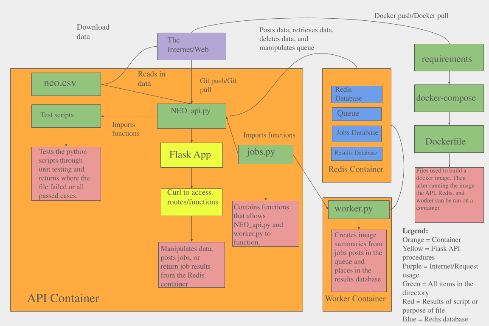

# Near Earth Objects: An Overview of Future Cosmic Encounters

## Objective:
This project was created to utilize a Flask web application to analyze a set of Near Earth Object data overseen by the Center for Near Earth Object Studies. The primary objective of the project is to create a structured database and Flask API that serves as a reliable tool for researchers to reference and utilize. The goal is to enhance the understanding of NEO data.

## Contents: 
This project contains the following files:
1. requirements.txt: A file listing the required Python packages for the project, ensuring a consistent environment.
2. Dockerfile: The file used to build a Docker container for deploying the Flask app.
3. docker-compose.yml: The file defines the services needed to run the application, such as setting up Redis and Flask.
4. src:
   - NEO_api.py: The main Flask script that handles routes for managing and querying NEO data.
   - jobs.py: Module that contains core functionality for working with jobs in Redis
   - worker.py: Module that contains the code to execute jobs.
5. test:
   - test_NEO_api.py: This script tests all the routes inside NEO_api.py to ensure no errors.
   - test_jobs.py: This script tests all the functions in jobs.py, ensuring no errors in the job methods.
   - test_worker.py: This script tests the functions that do the data analysis inside worker.py, ensuring accurate analysis.
6. kubernetes:
   - This folder contains all necessary `yaml` files to run the Flask API on a Kubernetes cluster.
     
## Scripts:
This folder contains the following scripts for the Flask web application:
1. **NEO_api.py (main script)**
This script contains routes that use the GET, DELETE, and POST methods to retrieve or delete data you want to analyze or interpret. Based on your route, the script will either retrieve the whole data set to store in Redis or delete the data sets from Redis. Beyond those functionalities, the script allows for analysis and exploration of the dataset. The script can also allow you to create jobs to the API where the parameters are a range of valid dates, retrieve job IDs, and check on the info about a certain job. Lastly, the script enables you to retrieve the results of a certain job, given the job ID. 
2. **jobs.py**
This script contains all the functions, both private and public, needed for the application to work with jobs and allows user interaction with the queue. 
3. **worker.py**
This script works to analyze the data and update jobs submitted by users and alters their status in the queue. Given a range of dates, this script will create a hexbin graph portraying the density of relative velocities and the near approach distances of NEOs in that range. Given a range of dates within a single month, it will create a scatter plot showcasing each NEO that will approach in that month, with the size of the dot corresponding to the magnitude and the color of the dot corresponding to its rarity.
4. **utils.py**
This script contains function definitions that are used in the api and worker modules.

## System Diagram:

The system diagram above depicts how the scripts and files in the directory interact with one another. It depicts how the separate containers are run and describes how they interact with each other as a Flask web API interacting with the user to return data summaries from data downloaded from the web. 

## Logging:
Please note that the current logging level is set to WARNING. If you wish to change this, open `docker-compose.yml` with a text or code editor and replace the WARNING in the environment LOG_LEVEL sections to whichever level you want to run. (DEBUG, INFO, WARNING, ERROR, CRITICAL) 

## Redis host IP
Please note that the current Redis host IP is set to redis-db. If you would like to change that open `docker-compose.yml` with a text editor. Then, under environment change, what `REDIS_HOST` is being set to.

## Data:
The dataset used in this project is sourced from the Center for Near-Earth Object Studies (CNEOS), which tracks the times and distances of Near-Earth Objects (NEOs) from 1900 A.D. to 2200 A.D. For this project, we are focusing specifically on future NEO events. To access the data used in this project, please use the following link: https://cneos.jpl.nasa.gov/ca/. The data is public on the CNEO website and is presented in both `CSV` and `EXCEL` formats. To view them, please download them onto your computer by accessing the data links at the bottom of the page. The dataset contains approximately 16,400 entries, each corresponding to a unique NEO. Each entry includes several key fields that provide important insights into the characteristics of these objects: Close-Approach Date, CA Distance Nominal (au), CA Distance Minimum (au), V relative (km/s), V infinity (km/s), H(mag), Diameter, and Rarity.
Available at: (https://cneos.jpl.nasa.gov/ca/) (Accessed: 4/20/2025).
   
## Launching Flask Application on Local Hardware:
1. **Retrieve Data**: Since this project focuses on future NEOs, please navigate to the above CNEOS website. Next, in the table setting, select `Future only` and then `Update Data`. After updating the data set, download the data as a `CSV`.
2. **Using Data**: To use the data for analysis, please first rename the downloaded data to `neo.csv`. Next, make a directory called `data`. Now, please move the `neo.csv` into the `data` directory.
3. **Pull Docker image**: First, make sure everything in this project repository is in the same directory. In the terminal, please run the command: `docker pull jyl2027/neo_api:1.0`
4. **Run Docker**: To run the container, please run the command: `docker compose up --build -d`. The `-d` flags allow the containers to run in the background.
5. **Final Steps**: Now that you have the container running, you must use curl commands to access routes to get the data you want. To run all the routes successfully, please first store the data into Redis using the POST command.
6. **Pytest**: If you want to run the pytests, first use the command `docker ps`. Identify the container ID of the flask app. Then run the command `docker exec -it <ID> bash` where `<ID>` is the ID of the container. From there, you can run `pytest test_NEO_api.py` or `pytest test_worker.py` or `pytest test_jobs.py`, depending on the test you want to run. Please run tests after first posting the data to Redis.
7. **Cleanup**: After you are done with the analysis, please run the command `docker compose down` to clear the containers.

## Launching Flask Application on Kubernetes (Tacc is your Tacc Username):
1. **Retrieve Data**: Since this project focuses on future NEOs, please navigate to the above CNEOS website. Next, in table setting, select `Future only` and then `Update Data`. After updating the data set, download the data as a `CSV`.
2. **Using Data**: To use the data for analysis, please first rename the downloaded data to `neo.csv`. Next, make a directory called `data`. Now, please move the `neo.csv` into the `data` directory.
3. **Pull Docker image**: First, ensure everything in this project repository is in the same directory. In the terminal, please run the command: `docker pull jyl2027/neo_api:1.0`
6. **Edit yaml files**: Now, please open the `yaml` files with a text editor. Replace all areas that say `<tacc>` with your Tacc username or namespace. 
7. **Launching Application**: To launch the application in production, please navigate to the `prod` directory inside the `kubernetes` directory. Now, please run the following commands individually: `kubectl apply -f app-prod-deployment-flask.yml`,
`kubectl apply -f app-prod-deployment-redis.yml`,
`kubectl apply -f app-prod-deployment-worker.yml`,
`kubectl apply -f app-prod-ingress-flask.yml`,
`kubectl apply -f app-prod-pvc-redis.yml`,
`kubectl apply -f app-prod-service-flask.yml`,
`kubectl apply -f app-prod-service-nodeport-flask.yml`,
`kubectl apply -f app-prod-service-redis.yml`
8. **Cleanup**: After using the appliction, please use the following commands for cleanup: `kubctrl delete all --all`, `kubctrl delete ingress --all -n <your namespace>`, and `kubctrl delete pvc --all`

## Routes and how to interpret results (Local hardware replace `<host>` with `localhost:5000`; if on kubernetes, please replace `<host>` with `neo-project.coe332.tacc.cloud`):
- `curl -X POST <host>/data`: This route takes the CSV-formatted data from the `neo.csv` and stores the data into Redis. Upon running this command, you will either expect a message regarding success, failure, or that data is already stored in the database.  `success loading data` and `failed to load all data into redis`.
- `curl <host>/data`: This route retrieves all of the data stored inside the Redis database. Upon running the command, you should expect to see all of the NEO objects and their data.
- `curl -X DELETE <host>/data`: This route deletes all of the data stored inside the Redis database. Upon running this command, you will either expect a message regarding success or failure in deleting all the data: `Database flushed` or `Database failed to clear`
- `curl <host>/jobs -X POST -d '{"start_date": "<date>", "end_date": "<date>", "<kind>": "<kind>"}' -H "Content-Type: application/json"`:
- `curl <host>/jobs`: This route will return all of the job IDs created by the user when posting a job. 
- `curl <host>/jobs/<jobid>`: This route returns data about a certain job. It will include information about the id, start, end, and kind parameters. Most importantly, it will also include the status of the job, ranging from `submitted`, `in progress`, and `complete`. To run this command, replace `<jobid>` with a valid job ID, which you can find using the `/jobs` route. An example output where the job was completed is shown below:
  ```json
   {
  "end": "2095-Oct-27",
  "id": "35dde259-788e-4181-926c-a0ab9ca03cb6",
  "start": "2025-Apr-16",
  "status": "complete"
   }
- `curl <host>/results/<jobid>`: This route will return the results of a certain job ID created by the user. This API will return a hexbin graph comparing relative velocities and nominal distances of NEOs. To run this command, replace `<jobid>` with a valid job ID, which you can find using the `/jobs` route. An example output where the result was retrieved is shown below:


- `curl <host>/help`: This route will return all the routes in the API. It gives a brief explanation of what each route does and some instructions on how to curl the route.
- `curl <host>/data/date`: This route returns all the dates and times for all the NEOs.
- `curl <host>/data/<year>`: Provided a year paramater (integer) as an input, this route returns all the NEOs that will be spotted in that year.
- `curl <host>/data/distance`: Provided a minimum(float) and maximum(float) values as inputs, this route will query through all the NEOs and return only the ones between the provided distances in astronomical units.
- `curl <host>/data/velocity_query`: Provided a minimum(float) and maximum(float) values as inputs, this route will query through all the NEOs and return only the ones between the provided velocities in kilometers per second.
Example Input: `curl localhost:5000/data/velocity_query?min=5&max=20`
- `curl <host>/data/max_diameter`: Provided a max diameter value as an input, this route will return all the NEOs with a max diameter less than the value provided.
- `curl <host>/data/biggest_neos/<count>`: Provided an integer value as an input, this route will return the biggest "x" number of NEOs where "x" is the provided input.
Example Input: `curl localhost:5000/data/biggest_neos/10`
- `curl <host>/now/<count>`: Provided an integer value as an input, this route will return the "x" number of NEOs closest to the current time where x is the provided input.
## Two Different Jobs
When posting a job, you have the choice between Job 1 and Job 2, specified with the 'kind' parameter. Job 1 creates a hexbin graph portraying the density of relative velocities and the near approach distances of NEOs in that range. This job will accept any range of dates. Job 2 creates a scatter plot showcasing each NEO that will approach in that month, with the size of the dot corresponding to the magnitude and the color of the dot corresponding to its rarity. This job is intended to be used on the NEO data for a given month, so it will only accept start and end dates that are in the same month. An example job posting is shown below:
``curl <host>/jobs -X POST -d '{"start_date": "2026-Apr-01", "end_date": "2026-Apr-30", "kind": "2"}' -H "Content-Type: application/json"``

## AI Use (Chat GPT): 
1. AI generated the pytests for the api, worker, and job scripts. AI was used for this because we don't have adequate experience working with Flask unittests and working with datetime.
